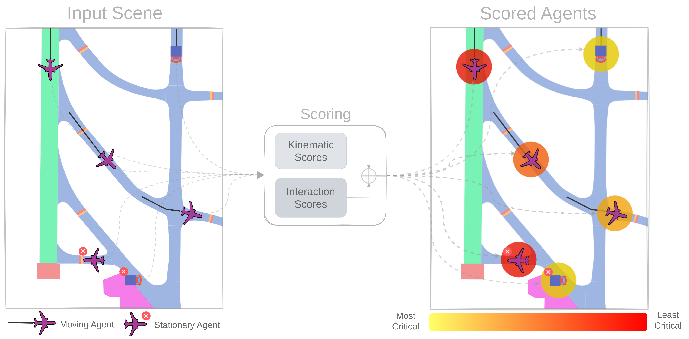

# AmeliaScenes

This repository contains the code used in this paper to generate scenes for trajectory forecasting.

***Amelia: A Large Dataset and Model for Airport Surface Movement Forecasting [[paper](https://arxiv.org/pdf/2407.21185)]***

[Ingrid Navarro](https://navars.xyz) *, [Pablo Ortega-Kral](https://paok-2001.github.io) *, [Jay Patrikar](https://www.jaypatrikar.me) *, Haichuan Wang,
Zelin Ye, Jong Hoon Park, [Jean Oh](https://cmubig.github.io/team/jean_oh/) and [Sebastian Scherer](https://theairlab.org/team/sebastian/)

## Overview

**AmeliaScenes**: Tool for generating airport surface movement scenes from raw trajectory data collected with [AmeliaSWIM](https://github.com/AmeliaCMU/AmeliaSWIM). It takes CSV files containing various fields representing agent trajectory data and produces scenes based on certain specifications, including number of desired agents and scene length.

<div align="center">
  
  <h5>Scene Example from Boston Logan International Airport (KBOS).</h5>
</div>

**AmeliaScenes** also provides scene and per-agent characterization tools as meta information for each agent's kinematic and interactive profile.

<div align="center">
  
  <h5>Scene Scoring Example.</h5>
</div>

Finally, **AmeliaScenes** also provides a dataset splitting script with various `train/val/test` splitting strategies.

## Pre-requisites

### Dataset

To run this repository, you first need to download the amelia dataset. Follow the instructions [here](https://ameliacmu.github.io/amelia-dataset/) to download the dataset.

Once downloaded, create a symbolic link into  `datasets`:

```bash
cd datasets
ln -s /path/to/amelia .
```

### Installation

Make sure that you have [conda](https://conda.io/projects/conda/en/latest/user-guide/install/index.html) installed.

**Recommended:** Use the  [`install.sh`](https://github.com/AmeliaCMU/AmeliaScenes/blob/main/install.sh) to download and install the Amelia Framework:

```bash
chmod +x install.sh
./install.sh amelia
```

This will create a conda environment named `amelia` and install all dependencies.

Alternatively, refer to [`INSTALL.md`](https://github.com/AmeliaCMU/AmeliaScenes/blob/main/INSTALL.md) for manual installation.

**Note:** AmeliaScenes only requires the Amelia dataset to run, only refer to AmeliaScenes installation.

## How to use

Activate your amelia environment (**Please follow the installation instructions above**):

```bash
conda activate amelia
```

### Generating scenes from raw data

Once you've installed the tools, and created the amelia environment, run:

```bash
cd amelia_scenes
python run_processor.py --airport <airport_icao> --parallel
```

where:

- `<airport_icao>`: [ICAO](https://en.wikipedia.org/wiki/ICAO_airport_code) code of the airport to be processed. It can be one of the following: `kbos`, `kdca`, `kewr`, `kjfk`, `klax`, `kmdw`, `kmsy`, `ksea`, `ksfo`, `panc`. By default it is set to `kbos`.
- `<parallel>`: If the processing should be done in parallel. By default it is set to `True`.

Additional parameters can also be specified:

```bash
python run_processor.py --airport <airport_icao> --to_process <scenes | metas | both> --parallel \
                        --base_dir <path_to_dataset> \
                        --traj_version <version>
                        --graph_version <version> \
                        --parallel <parallel> \
                        --overwrite <overwrite> \
                        --perc_process <percentage> \
                        --seed <seed> \
                        --jobs <jobs>
```

where:

- `<to_process>`: What to process. By default is set to `both`. Possible options are:
  - `scenes`: only generate scenes from the raw files
  - `metas`: generates meta information from already generated scenes. It uses scene scoring tools.
  - `both`: generates scenes and meta information, simultaneously.
- `<base_dir>`: Path to the dataset. By default the path is set to `../datasets/amelia`.
- `<traj_version>`: Version of the trajectory data. By default it is set to `a10v08`.
- `<graph_version>`: Version of the graph data. By default it is set to `a10v01os`.
- `<overwrite>`: If the processing should overwrite the existing data. By default it is set to `True`.
- `<perc_process>`: Top limit visualization of the data being processed. By default it is set to `1.0`.
- `<seed>`: Seed for the random number generator. By default it is set to `42`.
- `<jobs>`: Number of Python worker processes to be used in parallel. By default it is set to `-1`, which will use all available CPUs.

#### Expected output

The scene processor should generate scene files for a given CSV file into ```datasets/amelia/traj_data_{version}/proc_trajectories/{airport_icao}/{raw_file_tagname}```. Each scene file is a pickle file following the format ```scene_id.pkl```.

For example if the input file is ```KBOS_1_1672531200.csv```, found in:

```bash
|-- datasets
    |-- amelia
        |-- traj_data_a10v08
            | -- raw_trajectories
                | -- kbos
                    | -- KBOS_1_1672531200.csv
                | -- other airports
```

The output scenes will be in:

 ```bash
|-- datasets
    |-- amelia
        |-- traj_data_a10v08
            | -- raw_trajectories
            | -- proc_scenes
                | -- kbos
                    | -- KBOS_1_1672531200
                        | -- 00000.pkl
                        ...
                        | -- xxxxx.pkl
```

---

### Characterizing scenes

**TODO: Work in Progress**

---

### Creating dataset splits

Once the scenes are generated, the `run_create_splits.py` script can be run to split the dataset. The script can be run as follows:

``` bash
cd amelia_scenes
python run_create_splits.py --split_type <random | day | month>
```

Where:

- `<split_type>`: Type of split to be generated. By default it is set to `random`. Possible options are:
  - `random`: Randomly splits the dataset into `train/val/test` sets.
  - `day`: Daily splits the dataset into `train/val/test` sets.
  - `month`: Monthly splits the dataset into `train/val/test` sets.

Additional parameters can also be specified:

``` bash
cd amelia_scenes
python run_create_splits.py --split_type <random | day | month> \
                        --base_dir <path_to_dataset> \
                        --seed <seed> \
                        --traj_version <version> \
```

- `<base_dir>`: Path to the dataset. By default the path is set to `../datasets/amelia`.
- `<traj_version>`: Version of the trajectory data. By default it is set to `a10v08` to match the current released version.
- `<seed>`: Seed for the random number generator. By default it is set to `42`.

#### Expected Output

For the `kbos` generated scene and the argument `--split_type` as `random`, the script should generate the following files:

```bash
|-- datasets
    |-- amelia
        |-- traj_data_a10v08
            |-- raw_trajectories
            |-- proc_scenes
            |-- splits
                |-- train_splits
                    |-- kbos_random.txt
                |-- val_splits
                    |-- kbos_random.txt
                |-- test_splits
                    |-- kbos_random.txt
```

## BibTeX

If you find our work useful in your research, please cite us!

```bibtex
@inbook{navarro2024amelia,
  author = {Ingrid Navarro and Pablo Ortega and Jay Patrikar and Haichuan Wang and Zelin Ye and Jong Hoon Park and Jean Oh and Sebastian Scherer},
  title = {AmeliaTF: A Large Model and Dataset for Airport Surface Movement Forecasting},
  booktitle = {AIAA AVIATION FORUM AND ASCEND 2024},
  chapter = {},
  pages = {},
  doi = {10.2514/6.2024-4251},
  URL = {https://arc.aiaa.org/doi/abs/10.2514/6.2024-4251},
  eprint = {https://arc.aiaa.org/doi/pdf/10.2514/6.2024-4251},
}
```
